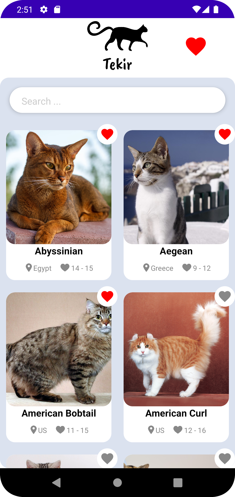
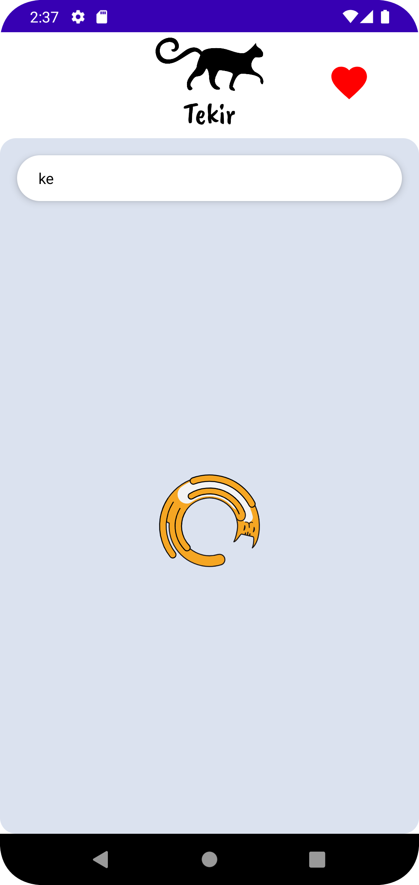
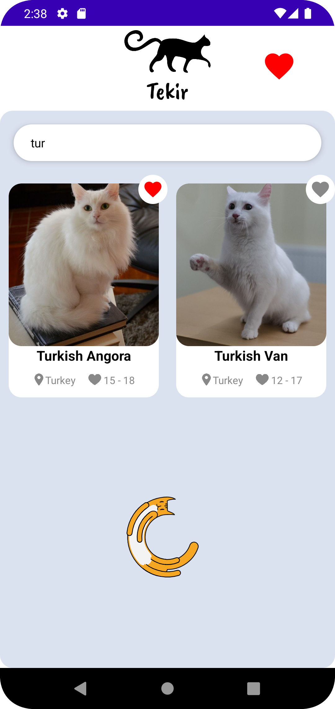
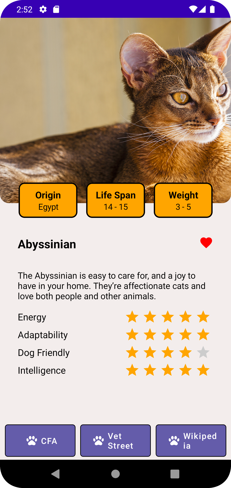

# Tekir-v2 🐈

Tekir, API'den kedi ırkları ve bilgilerinin yer aldığı bir uygulama.

# Uygulama Görüntüleri

    
    
 

# API 

API:
https://docs.thecatapi.com/api-reference/breeds/breeds-list

# Kullanılan Teknolojiler

<ul>
  <li>Kotlin</li>
  <li>MVVM Architecture</li>
  <li>Jetpack Compose</li>
  <li>Dagger Hilt</li>
  <li>Coroutines</li>
  <li>ViewModel</li>
  <li>Retrofit</li>
  <li>Coil</li>
  <li>Hawk</li>
  <li>Navigation</li>
</ul>

# İletişim

`Kerem Ersu` => [LinkedIn](https://www.linkedin.com/in/kerem-ersu-0082ba194/)
